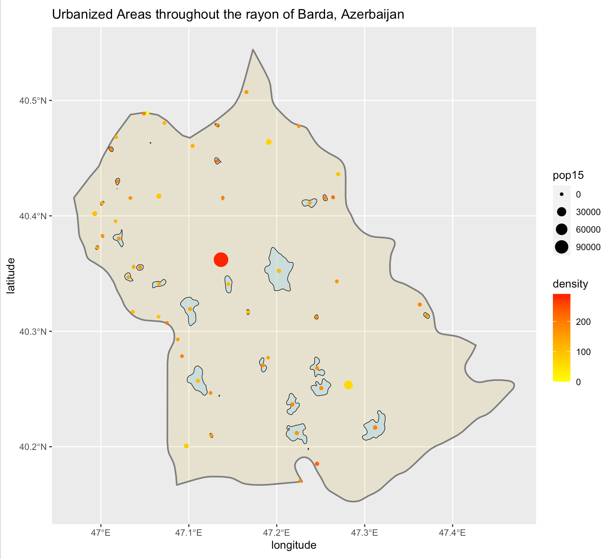
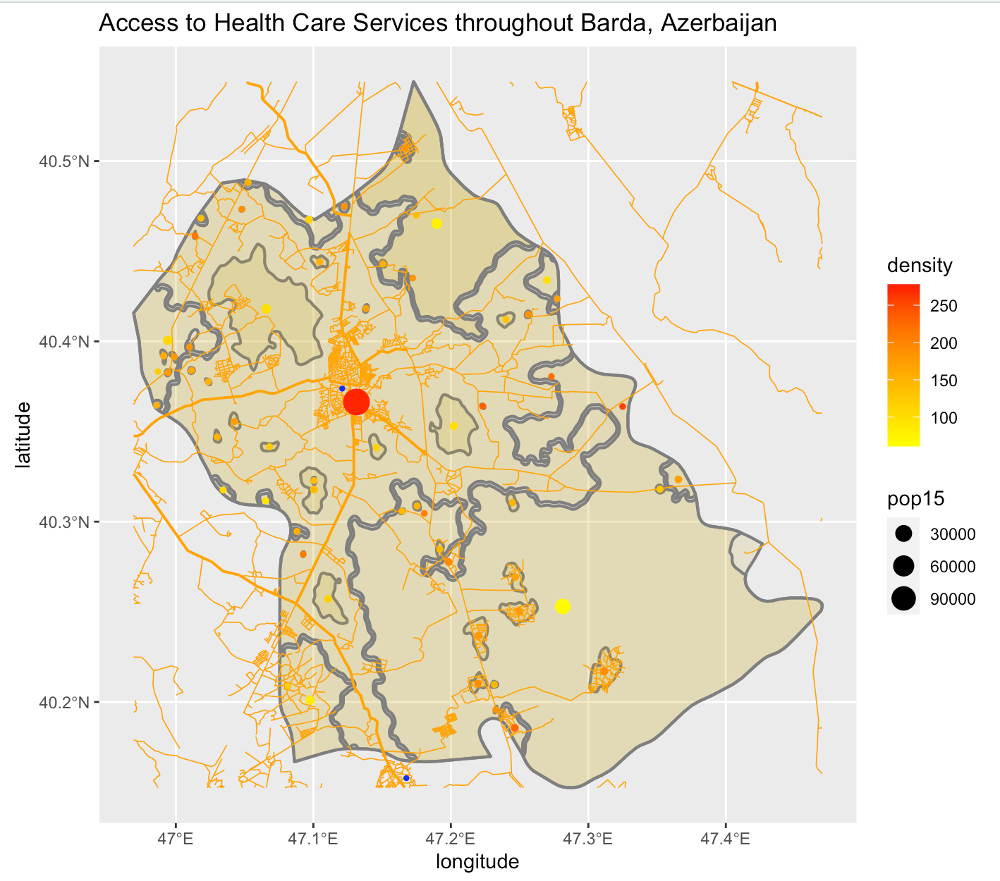
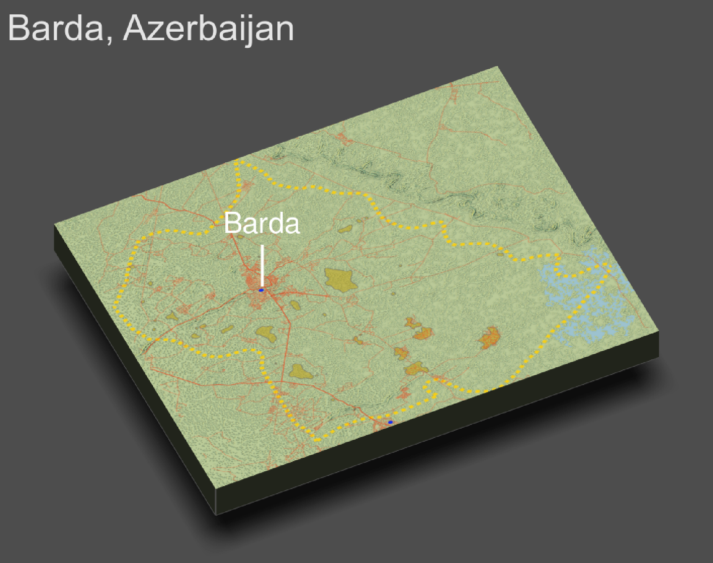

## Accessibility 1

Here is a plot that describes the de facto urbanized areas where people live within Barda, Azerbaijan (in blue). The dots represent the population of each area, while their color represents the population density, with red depicting the greatest.

## Accessibility 2

This plot shows where people live in Barda, along with where roads and health care facilities are. 

The population of Barda is about 155,000, and there appear to be 59 distinct settlements/urban areas throughout. The vast majority of people live in the capital, also named Barda, which has a population of about 114,000 people. The reason that this number is so much larger than the de jure population of Barda City is probably because more people have settled in and around the city than only those who live within the legally defined area of the city.

The orange lines depict roadways, where the thicker lines represent primary roadways. It looks like there are more roads where more people live, which makes sense. 

It also appears that there are only two health care facilities in Barda, both hospitals. While at first this appears concerning, it is worth noting that most people in the region have access to a hospital simply because the majority live in Barda City, the location of one hospital. Other people of Barda can reach a second hospital (which is technically outside of Barda), and most of the region is well-connected to it by roads. However, there are certainly areas of Barda that are far from a hospital, such as those in the East or those right between the two hospitals. Nonetheless, it's worth noting that Barda is only 370 square miles; I'd estimate that it's very unlikely that someone would need to drive more than, say, 25 miles to get to one of the hospitals.

## Accessibility 3

Finally, here is a 3D plot that describes the topopgraphy, urban areas, roads, and hospitals of Barda. It looks like Barda is fairly flat, and the few topographical features that can be discerned are minimal. However, you can see that some roads travel alongside those features. Urban areas don't seem to have any obvious relationship to topography here, possibly because there are no big mountains or valleys to cause that. Health care facilities simply seem to be where the confluences of roads are, meaning that they, too, aren't very affected by topography. 

I suppose that my interpretation is the same from this map as it was from the previous one because of the minimal impact of topography on settlement.

Also, it's worth noting that this depiction may be incorrect, as the eastern border of Barda may follow the river that can be seen here. I tried to refit the width and height to match the two, but it wasn't possible, as it appears that the depicted region won't extend past the current field of view, for some reason. I can't find the information on the internet, either. However, I'd actually guess that the depiction above is correct because of the way some roads line up perfectly with minor topographical features.
