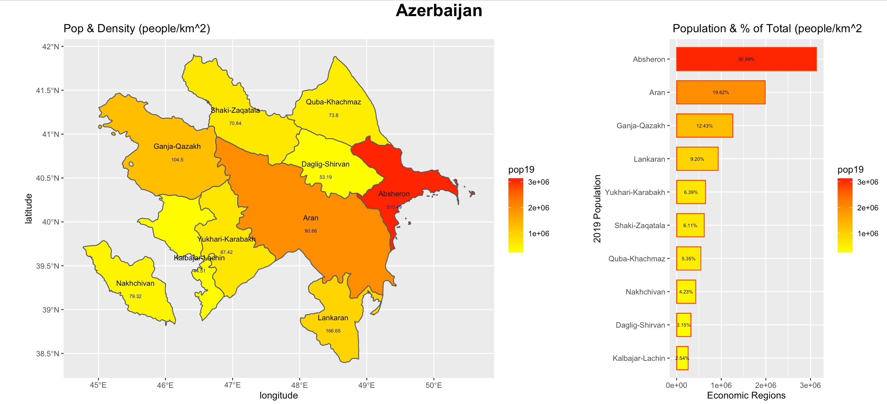
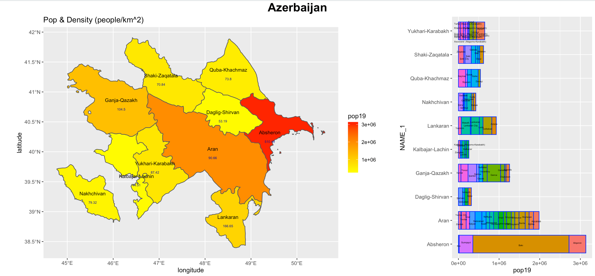
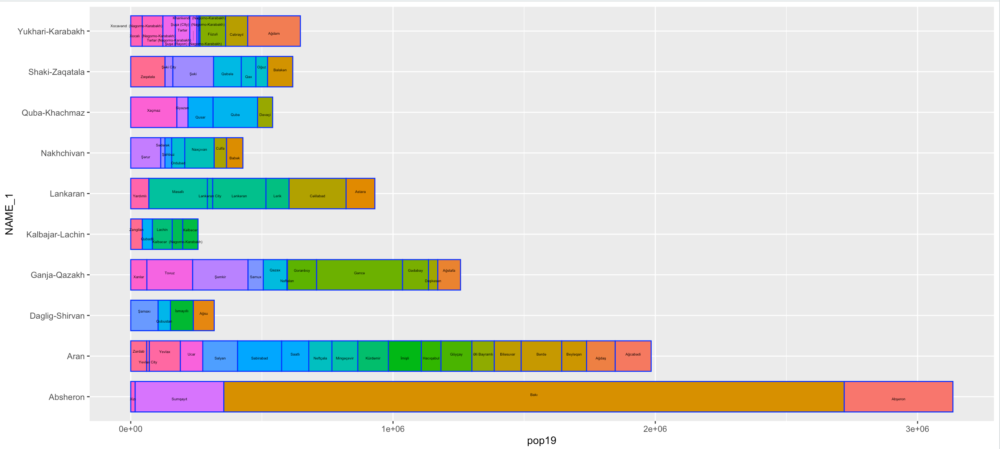

## Deliverable

Here's a combined spatial description and bar plot of Azerbaijan's population divided by economic region (adm1). I used ggplot for both plots and combined the plots using ggarrange. I modified the width of the bars and size of the text to accomodate Azerbaijan's small number of regions, but overall I didn't have to make too many changes specific to Azerbaijan. The spatial description and density labels makes it clear that much of the population of the country is concentrated in Absheron, the region containing the capital.

## Stretch Goal 1

Here's another combined spatial description and bar plot, but this bar plot describes the portions of the population contained in the rayons (adm2) within each economic region. Below is a nicer image of just the bar plot.

