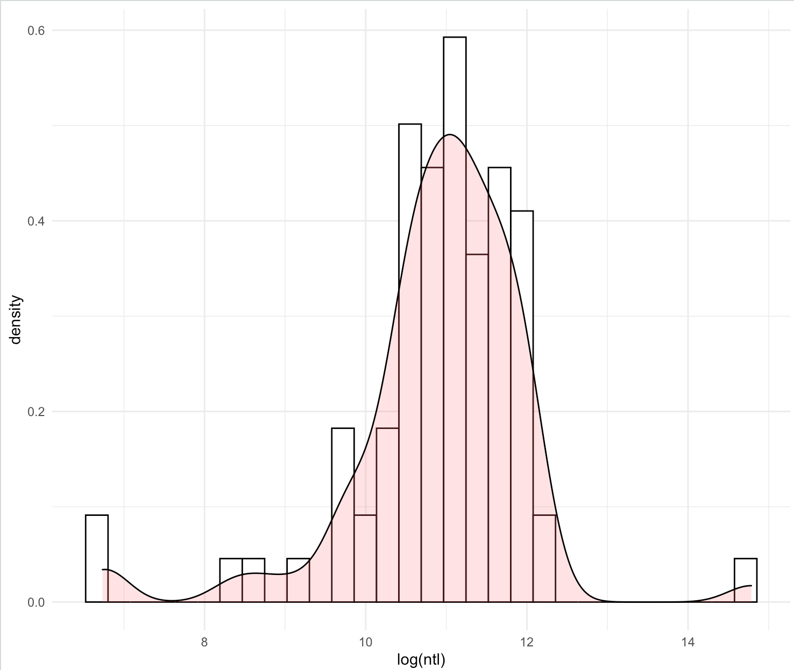
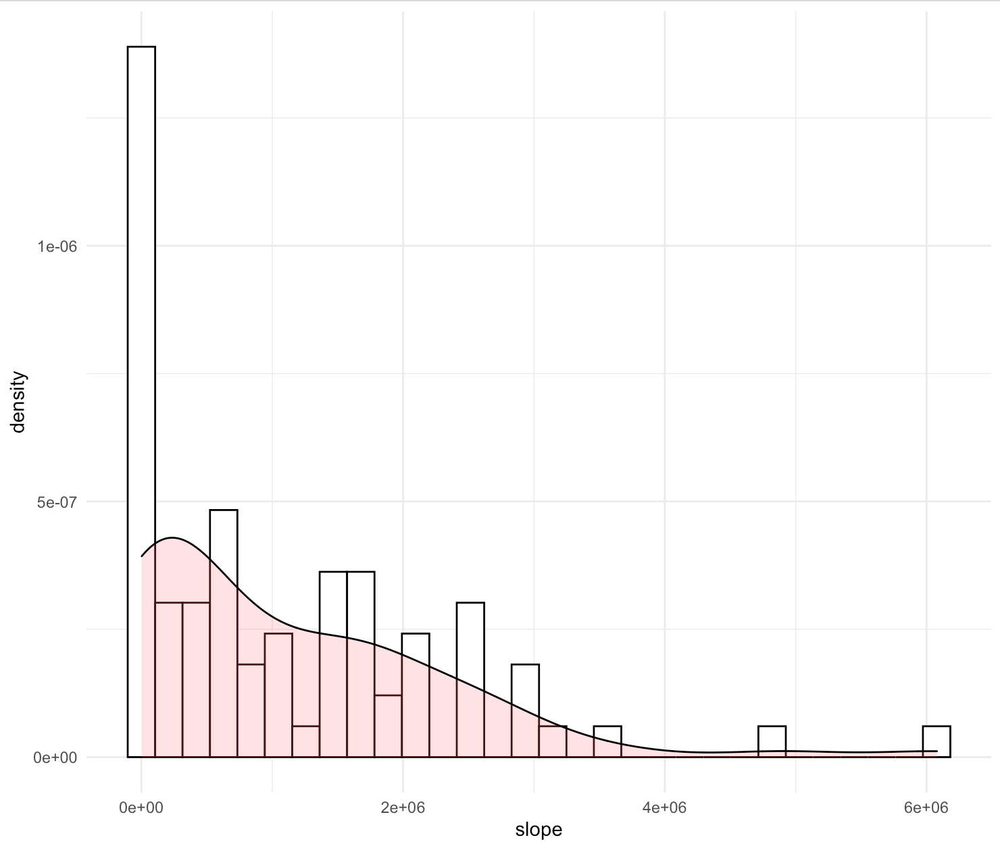
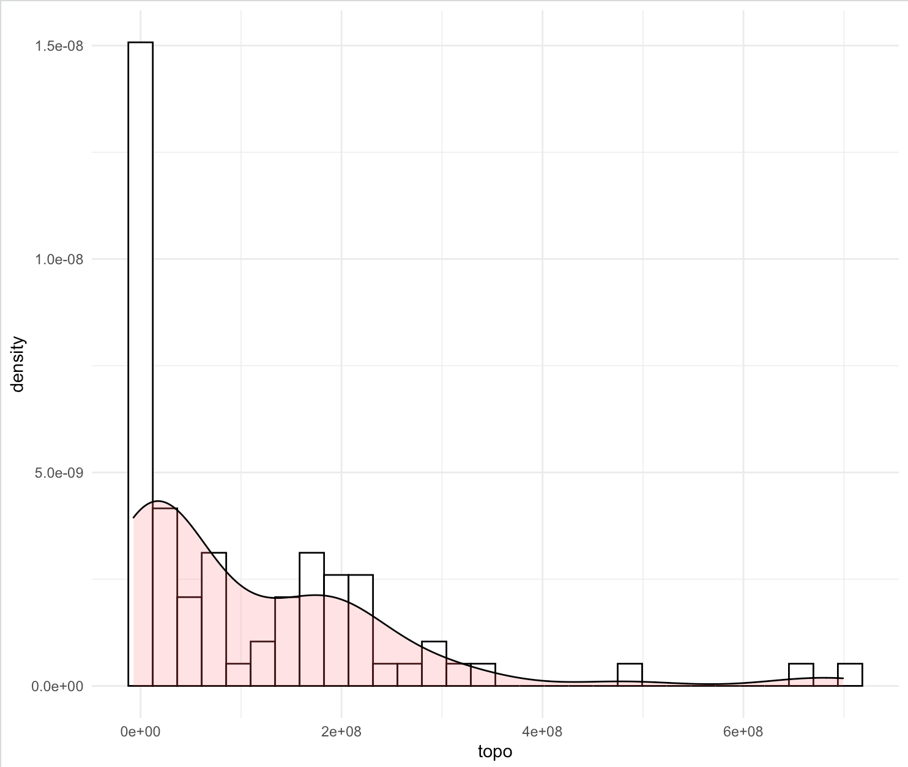

Here is a histogram and density plot displaying the population distribution of Azerbaijan present in rayons with certain levels of nighttime lights (and therefore energy consumption). The density plot and histogram display the same data, but the histogram is divided into bins while the density plot is a continuous representation of the data.

Here's a similar plot displaying how much of Azerbaijan's population lives in rayons with a certain average (so it seems) slope. Population density looks to be lowest in hillier/mountainous regions.

This plot is also similar, but uses topography data for the independent variable. The slope data is understandably calculated from the topography data, so it's not surprising that this looks similar to the above.
