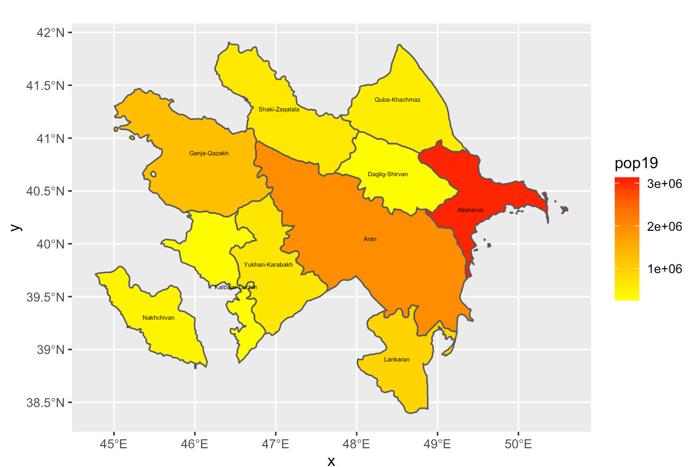

## Deliverable 

Here's a map depicting the population of each economic region of Azerbaijan on a gradient from yellow to red. Absheron is clearly the most populous region.

## Stretch Goal 1

Here's a map which goes more in depth and depicts the population of each rayon (district) of Azerbaijan. This time, the gradient is from light to dark blue. It's quite clear how densely populated the capital (Baku) is, even on a logarithmic scale. For aesthetic and informational purposes, I actually made the midpoint for the gradient 13 rather than the technically correct midpoint, 11. Because of the heavy concentration of people in Baku, most of the map would have appeared a very similar color otherwise.

## Stretch Goal 2

Here's a similar map, but with more labels and lines denoting the economic regions (adm1). This map has a gradient from blue to red, with a yellow midpoint set at 13 again.

## Stretch Goal 3

My computer didn't cooperate, but here's the code that should've produced my movie (although I'm not sure, because usually I troubleshoot after producing the endgoal):

    
    ggaze_adm2 <- ggplot(aze_adm2) +
      geom_sf(aes(fill = log(pop19))) +
      scale_fill_gradient2(low = "blue", mid="yellow", high="red", midpoint = 13)

    plot_gg(ggaze_adm2, multicore = TRUE, width = 6, height=2.7, fov = 70)

    render_snapshot(clear = TRUE)

    render_depth(focallength=100,focus=,72)

    render_movie(aze.mp4)

    save(aze_adm1, aze_adm2, file = "aze_adms_RData"
