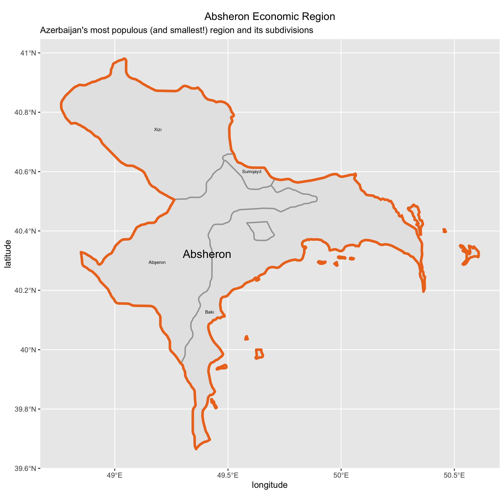
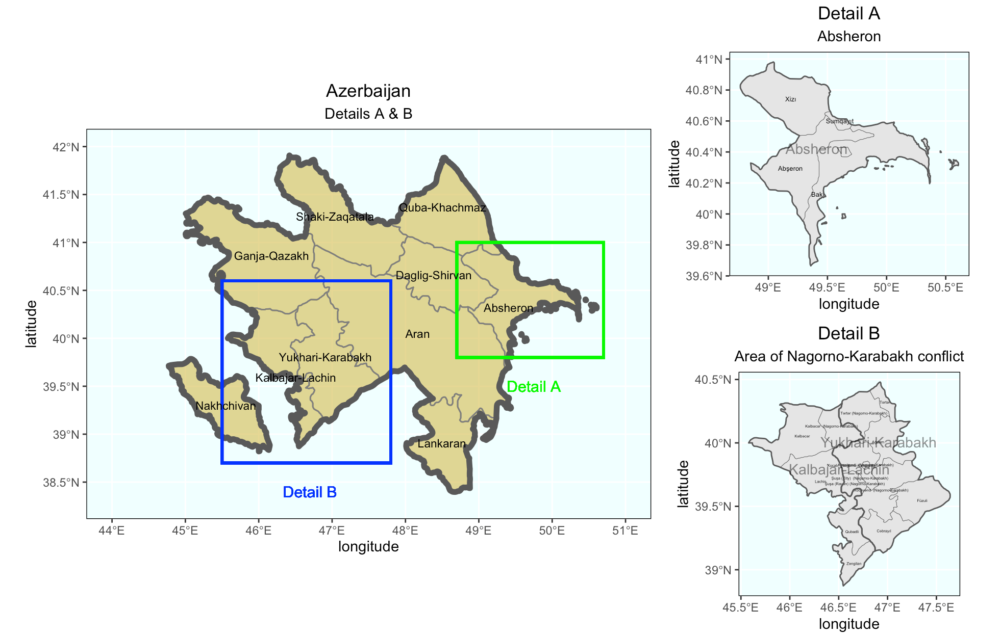

## Deliverable

This is a map of Azerbaijan with its first two subdivisions. The first, although not technically an administrative division, is comprised of the 10 economic regions, and the second is comprised of the cities and rayons (districts). 

## Stretch Goal 1

I explored the geoBoundaries website and found that its data for Azerbaijan is split between sources. ADM2 coems from Wikipedia, which is a secondary source. It seems that users create maps themselves based on other sources, but it's unclear what those are in this case. ADM0 and ADM1 come from OpenStreetMap, which contains crowdsourced data made available under the open database licence (similar to Wikipedia, it seems). Therefore, it's basically a compilation of many different primary sources. 

## Stretch Goal 2

This is a map of Absheron, Azerbaijan's largest region in terms of population and smallest region in terms of area (therefore also making it the densest). The national capital, Baku, is also in this region.

## Stretch Goal 3

Finally, here's a map of Azerbaijan with two additional plots. Detail A focuses on Absheron, while Detail B focuses on Upper Karabakh and Kalbajar-Lachin. These two regions are the location of the Nagorno-Karabakh conflict, an unresolved conflict between Armenia and Azerbaijan which has seen renewed violence recently. 
