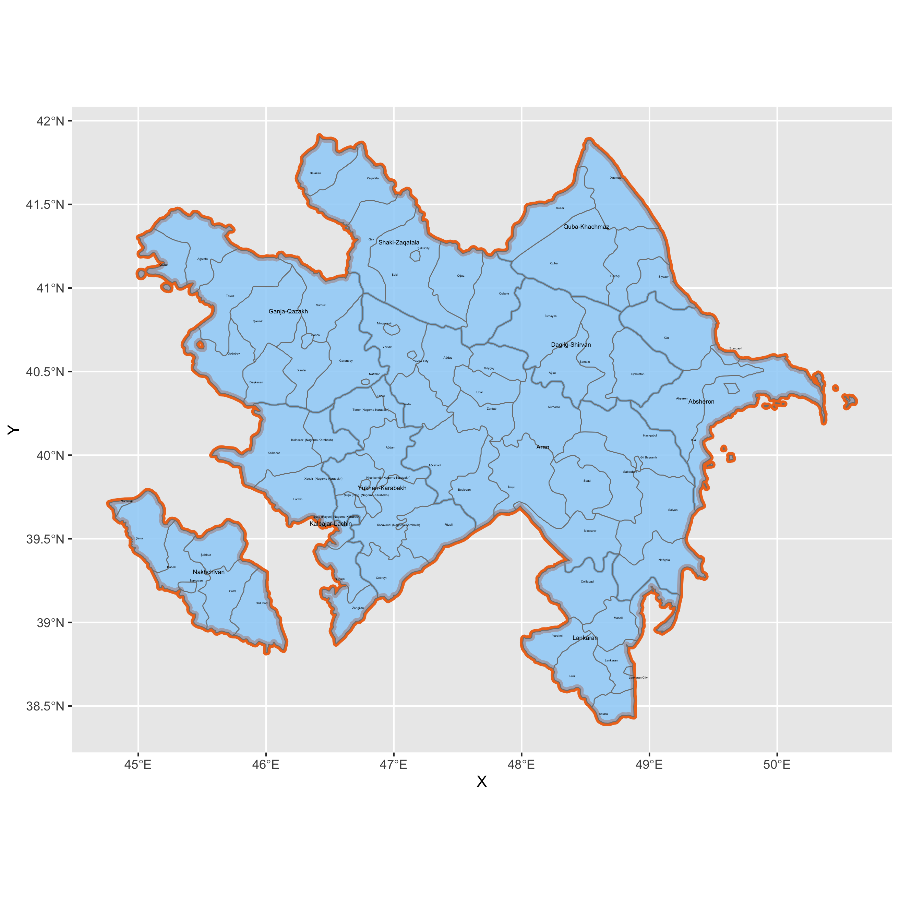

## Deliverable

This is a map of Azerbaijan with its first two subdivisions. The first, although not technically an administrative division, is comprised of the 10 economic regions, and the second is comprised of the cities and rayons (districts). 

