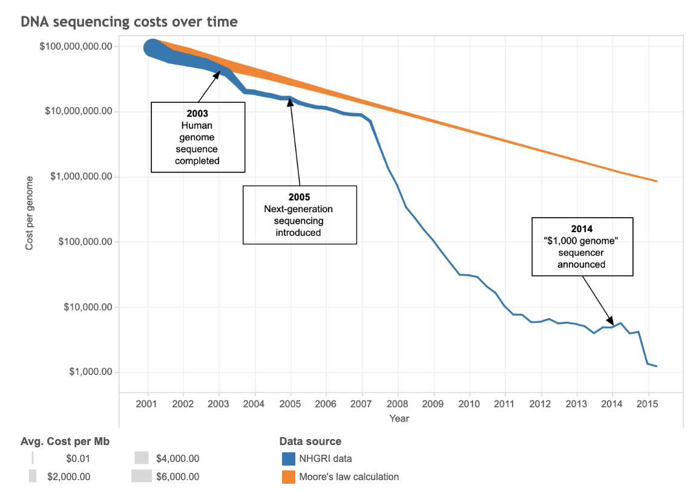

## Reflection 3

Genomic Data and the Human Genome Project

It took over twelve years, lasting from 1990 to 2003, and nearly 3,000 researchers for the human genome to be sequenced for the first time in what was called the Human Genome Project.

Thanks to that effort, whose results are widely and freely available, researchers can find a huge amount of genomic data online. Various databases exist to record the knowledge gained from the project and later discoveries; these databases are continuously updated as new information is incorporated. 

In fact, there’s been plenty to discover since the Human Genome Project ended. For example, because of the genetic variation among humans, sequencing only one genome does not fully represent every person on Earth; if each of our genomes were exactly the same, we wouldn’t have the unique traits that we do from birth. To solve this issue, the 1000 Genomes Project, completed in 2013, aimed to find genetic variants which made up at least 1% of certain populations. By 2019, 100,000 entire genomes had been sequenced. Still, with 3 billion bases in the human genome, there’s always more to understand. Even now, more work must be done to ensure all of the world’s populations are adequately represented in genomic data. 

This data is especially useful in the field of bioinformatics, in which genes and mutations are often identified and analyzed. These discoveries can lead to the development of new drugs and also let us diagnose patients by finding mutations in their genes. Importantly, the more variation we record among humans’ genomes, the more useful diagnoses and medicines can become. One hot topic is personalized medicine, which tailors drugs to an individual’s particular genes so that they can work best.

Fortunately, the efficiency of genome sequencing has been increasing rapidly over time due to improvements in both speed and cost. This is largely thanks to tools such as AI, MapReduce (a programming model that lets us deal with huge amounts of data more quickly) and SQL (a programming language which allows us to easily retrieve data). The blue line on the below graph illustrates just how quickly the cost to sequence one genome has dropped since the very first, nearly 3-billion-dollar effort.

***
 
 

Works Cited

 
 

“About IGSR and the 1000 Genomes Project.” IGSR: The International Genome Sample Resource, www.internationalgenome.org/about/.
   
Bobriakov, Igor. “Top 7 Data Science Use Cases in Healthcare.” Medium, ActiveWizards - AI & ML for Startups, 27 Mar. 2018, medium.com/activewizards-machine-learning-company/top-7-data-science-use-cases-in-healthcare-cddfa82fd9e3.
   
“The Human Genome Project.” National Human Genome Research Institute, National Human Genome Research Institute, 16 Sept. 2020, www.genome.gov/human-genome-project.
  
Nawrat, Allie. “From Rare Diseases to Covid-19: Charting the History of Genomics England.” Pharmaceutical Technology, 14 Oct. 2020, www.pharmaceutical-technology.com/features/from-rare-diseases-to-covid-19-charting-the-history-of-genomics-england/.
  
“New Guide Helps Researchers Mine Genome Data.” National Human Genome Research Institute, National Human Genome Research Institute, 25 Feb. 2012, www.genome.gov/10005087/2002-release-new-guide-helps-researchers-mine-genome-data.
  
Ulrich, Tom. “Opinionome: Can DNA Sequencing Get Any Faster and Cheaper?” Broad Institute, Broad Institute, 13 Sept. 2016, www.broadinstitute.org/blog/opinionome-can-dna-sequencing-get-any-faster-and-cheaper.
  
“What Is Personalized Medicine?” The Jackson Laboratory, www.jax.org/personalized-medicine/precision-medicine-and-you/what-is-precision-medicine. 
